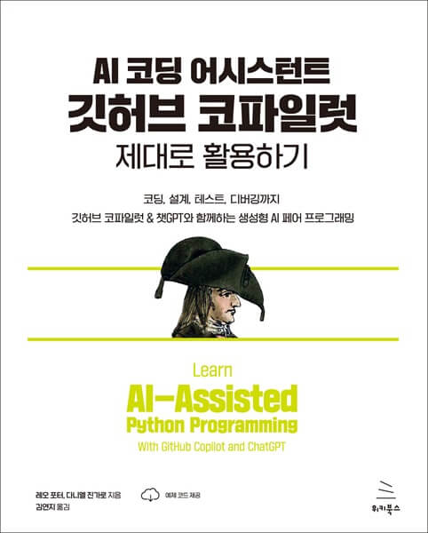

# AI 코딩 어시스턴트 깃허브 코파일럿 제대로 활용하기
### 코딩, 설계, 테스트, 디버깅까지 깃허브 코파일럿 & 챗GPT와 함께하는 생성형 AI 페어 프로그래밍

- **레오 포터, 다니엘 진가로** 지음 | **김연지** 옮김
- ISBN: 9791158395209
- 판형: 188\*240\*15mm
- 28,000원 | 2024년 5월 21일 발행 | 360쪽
- [책 홈페이지](https://wikibook.co.kr/copilot/)
- [도서 미리보기](http://www.yes24.com/Product/Viewer/Preview/126516854)
- [도서 관련 문의](https://wikibook.co.kr/support/contact/)

---

**무한한 잠재력을 지닌 AI 지원 코딩 도구를 사용해 효율적으로 코딩하세요!**

컴퓨터 프로그램을 작성하는 방식이 완전히 바뀌었습니다. 깃허브 코파일럿(GitHub Copilot)은 사람의 말로 프로그램이 수행하기를 원하는 작업을 설명하면 AI가 즉시 코드를 생성합니다.

이 책은 코드를 작성해 본 적이 없는 사람도 AI를 사용해 파이썬 프로그램을 만들고 개선할 수 있는 길을 보여줍니다. 프로그래밍의 자잘한 세부 사항에 시간을 낭비하는 대신, AI 어시스턴트로 아이디어를 즉시 실현하는 방법을 배워보세요. 책을 따라 하다 보면 AI 어시스턴트가 생성하는 내용을 이해하고 개선할 수 있을 만큼 파이썬 언어도 익힐 수 있습니다.

컴퓨터에서 파일을 옮기고 새로운 프로그램을 설치할 수 있는 사람이라면 누구나 유용한 소프트웨어 작성법을 배울 수 있습니다!

**★ 이 책에서 다루는 내용 ★**

- 작업 코드에 대한 프롬프트
- AI의 도움을 받아 수동으로 코드 수정하기
- 프로그램에 대한 AI 테스트
- 지루한 세부 작업을 AI에 맡기기

**★ 추천사 ★**

> "...프로그래밍의 기초와 AI 도구를 사용한 효과적인 코드 생성 방법을 탁월하게 결합해 설명합니다." - 메흐란 사하미, 스태퍼드 대학교

> "이제 막 생성형 AI 도구를 사용한 코딩을 시작한 사람의 입장에서 이 책은 정말 잘 구성된 책입니다." - 애나 벨, MIT

> "금세기의 가장 흥미로운 인간 작업 도우미인 인공지능과 함께 프로그래밍을 배우게 될 것입니다...” - 베스 사이먼, UC 샌디에이고, 서문 중에서

> "이 책은 제가 생각했던 것 이상으로 코파일럿을 사용한 프로그래밍 학습을 깊이 있게 다룹니다." - 오스틴 Z.헨리, Microsoft

---
 
 ## 구입처
 
 - [예스24](https://www.yes24.com/Product/Goods/126516854)
 - [교보문고](https://product.kyobobook.co.kr/detail/S000213260048)
 - [인터파크](https://book.interpark.com/product/BookDisplay.do?_method=detail&sc.prdNo=356912917)
 - [알라딘](https://www.aladin.co.kr/shop/wproduct.aspx?ItemId=339488413)
